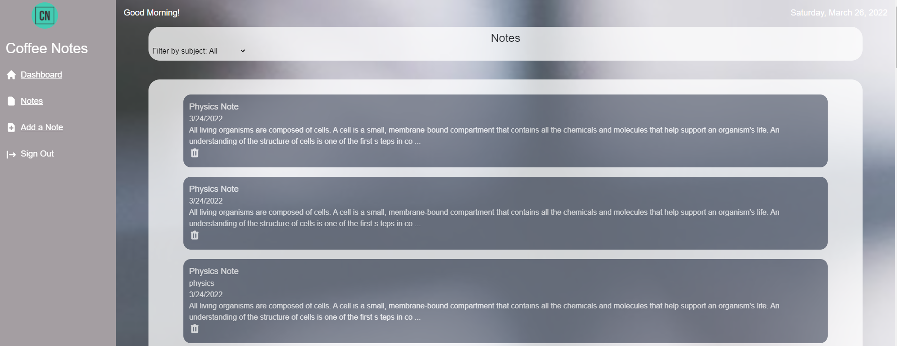

# CoffeeNotes

<!-- TABLE OF CONTENTS -->

  
Table of Contents

  <ol>
    <li>
      <a href="#about-the-project">About The Project</a>
      <ul>
        <li><a href="#features">Features</a></li>
        <li><a href="#built-with">Built With</a></li>
        <li><a href="#screenshots">Screenshots</a></li>
        <li><a href="#links">Links</a></li>
      </ul>
    </li>
    <li><a href="#development-team">Development Team</a></li>
    <li><a href="#contributing">Contributing</a></li>
    <li><a href="#questions">Questions</a></li>
    <li><a href="#license">License</a></li>
  </ol>

<!-- ABOUT THE PROJECT -->
## About The Project
CoffeeNotes is a full-stack application that allows students to take notes for their classes. Notes are organized by subject and include a title and content. CoffeeNotes was created as part of [Chingu](https://www.chingu.io/) Voyage 37.

### Features
* Users are able to create and edit notes using a powerful rich text editor
* Users are able to read and delete notes
* Users can filter notes by subject
* Users are able to sign-up, log-in and log-out
* Users can view a landing page that includes information about the developers and application

### Built With
* [Next.js](https://nextjs.org/)
* [React.js](https://reactjs.org/)
* [Tailwind CSS](https://tailwindcss.com/)
* [Heroicons](https://heroicons.com/)
* [Quill](https://quilljs.com/)
* [Go](https://go.dev/)
* [Supabase](https://supabase.com/)
* [PostgreSQL](https://www.postgresql.org/)
* HTML, CSS, JavaScript 

### Screenshots
#### Landing Page

#### Dashboard

#### Create a Note

#### Notes Page

### Links
- [GitHub repository](https://github.com/chingu-voyages/v37-bears-team-12)
- [Deployed application](https://coffeenotes.vercel.app/)

<!-- DEVELOPMENT TEAM -->
## Development Team
Mateo Cruz
- [GitHub](https://github.com/cruzma)
- [LinkedIn](https://www.linkedin.com/in/mateo-cruz-b76619133/)

Carlos Martinez
- [GitHub](https://github.com/curlos)
- [LinkedIn](https://www.linkedin.com/in/carlos-martinez-cs/)

Daryl Nauman
- [GitHub](https://github.com/darylnauman)
- [LinkedIn](https://www.linkedin.com/in/darylnauman/)

Z
- [GitHub](https://github.com/zxcv3)

<!-- CONTRIBUTING -->
## Contributing
Please contact a member of the development team if you wish to contribute to this application.

<!-- QUESTIONS -->
## Questions
Please contact any members of our team.

<!-- LICENSE -->
## License
This product is under the MIT License. 
